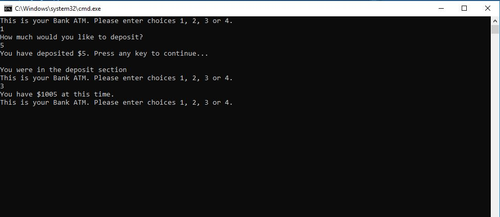

1. Name
# Lab02 Unit Testing

2. One-Liner
This program is a C# Console application replicating an imaginary ATM with 4 choices: deposit, withdraw, check balance and exit.

3. Usage

a. First install appropriate programs. Refer to Step 5 in this README.
b. You will be given 4 numbered choices: deposit, withdraw, check balance and exit.
c. If you type in 1, you get to deposit. Put in a numbered amount pertaining to a decimal and you will then be shown how much you deposited and be returned.
d. If you type in 2, you get to withdraw. Put in a numbered amount pertaining to a decimal and you will then withdraw the amount in the balance. If you put in more than what is in the balance, you will be kicked out.
e. If you type in 3, you will get to see your balance. Depending on what you did when you deposited or withdrew, the balance will show the result. You will then be sent back to the main menu.
f. If you type in 4, you will then be exited of the program.
e. Rule of thumb is if you type anything besides any of the choices, you will be either kicked out of the program or given a message saying "Problem occurred."

Visual

4. API
No API's were harmed in the making of this.

5. Installation
Install Visual Studio 2017 and .NET Core SDK.

6. License
This program's License is MIT.